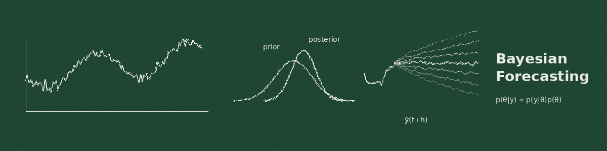

🎯 I'm a statistician/data scientist working on forecasting at Airbnb.

📈 I develop Bayesian compositional time series methods, including the B-DARMA and B-DARCH frameworks.

📝 I write [papers](https://scholar.google.com/citations?user=0_TISfYAAAAJ&hl=en) on demand forecasting, probabilistic prediction, and hierarchical time series.

🔗 [harrisonekatz.com](https://harrisonekatz.com)

---

